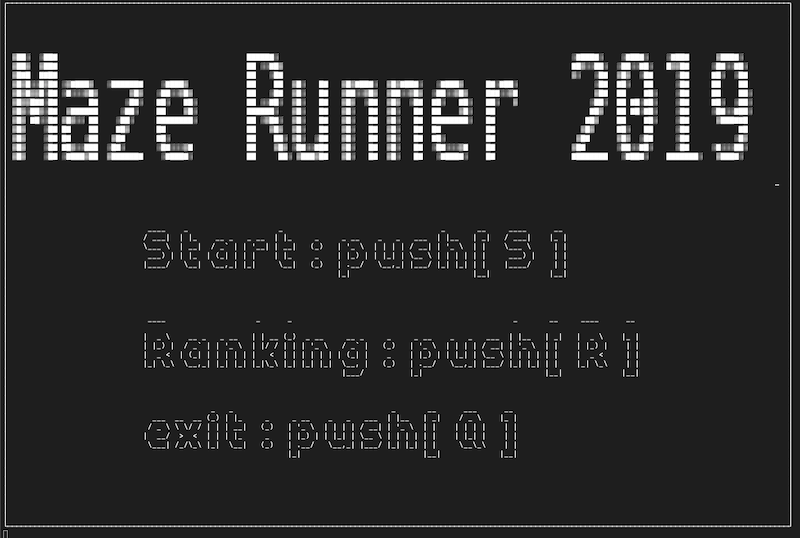
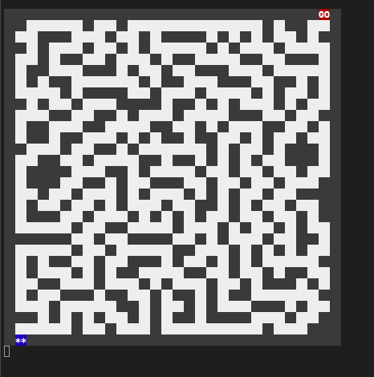
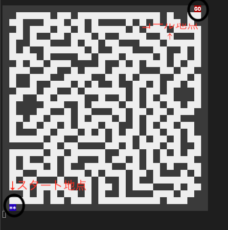
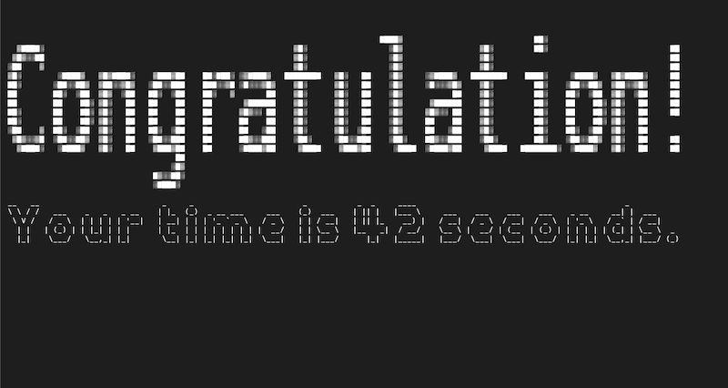
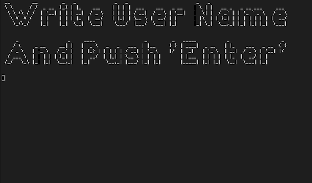

# Maze Runner 2019

## このゲームについて

このゲームはスタート地点からゴール地点まで移動して迷路から脱出するゲームです。

対戦要素として、スタート地点からゴール地点までにかかった時間を計測して全回数記録してます。知り合いの方とぜひ競い合ってみてください。

## こだわった要素

ランキングデータの取得や音声ファイルの展開など処理に時間がかかるものは、非同期で実行するようにした。

ランキングデータをスプレッドシートに書くことで、他のアプリケーションとの連携を容易にした。

全体的にCLIで動いている感を無くすように、音、操作、見た目等を工夫して、できる限りGUIに近づけた。

## 画面説明

- Start:push[S] 
  - Sキーを押すとゲームが始まる
- Ranking:push［R］
  - Rキーを押すとランキングが表示される
- exit:push[Q]
  - Qキーを押すと正常終了する

## 操作説明

Sキーを押すとこのような画面に移り、時間の計測が始まります。

プレイヤーをカーソルキーorWASDキーで移動してゴールを目指します。

プレイヤーが通れる道を白で、壁を灰色で表現しています。

スタート地点は画像の左下になります。

プレイヤーのいる地点が青背景で塗りつぶされ、**\*\***　で表現されてます。

ゴール地点は右上の赤背景で塗りつぶされて、**GO**と書かれているところになります。

Rキーを押すとプレイヤーの位置を初期位置の左下に動かせるので、迷ったときはお使いください。

また、Nキーを押すと迷路を新規作成し直します。

## リザルト画面

ゴール地点に到達したらリザルト画面に移ります。

まず、かかった時間が表示されます。

その後表示されるプレイヤー登録画面が画像のになります。

この画面上でプレイヤー名(大文字英語のみ)を入力し、エンターを押すと登録が完了されメニュー画面に移動します。

他の結果を見るには、メニュー画面からランキングを表示してください。

## おわりに
